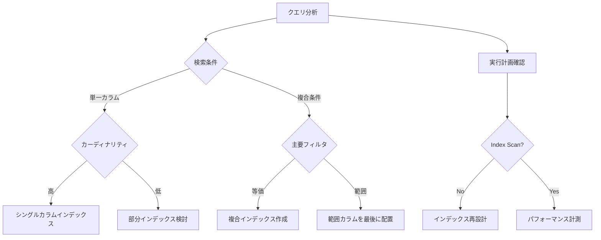

## データベース設計のインデックスについてまとめ

pk の単一インデックス、ユニークなカラムの単一インデックス、部分インデックス、複合インデックスの 4 つについてまとめ。
最適なインデックスが貼れるようになろう。できればちゃんとパフォーマンスを計測しながら改善できるとベスト。

### サンプルテーブル

**`offices` テーブル**

- **用途**  
  提携事業所情報を管理するマスタテーブル。  
  事業所の詳細情報を保持し、アプリケーションからの検索やフィルター条件に利用される。

#### カラム説明

| カラム名     | 型          | 制約                                         | 説明                             | インデックス | その他備考                                                                                           |
| ------------ | ----------- | -------------------------------------------- | -------------------------------- | ------------ | ---------------------------------------------------------------------------------------------------- |
| id           | SERIAL      | PRIMARY KEY, NOT NULL                        | 事業所の一意の ID                | デフォルト   | 主キーによる索引が自動的に設定される                                                                 |
| name         | TEXT        | NOT NULL                                     | 事業所の正式名称                 | -            |                                                                                                      |
| office_code  | VARCHAR(10) | UNIQUE NOT NULL                              | 事業所独自の一意のコード         | 単一         |                                                                                                      |
| phone_number | VARCHAR(20) | NULL CHECK (phone_number ~ '^[0-9-]\*$')     | 代表電話番号                     | -            | 半角数値とハイフンのみ許可。例: 03-1234-5678 または 09012345678                                      |
| status       | INT         | NOT NULL CHECK (status IN (0,1,2)) DEFAULT 1 | 状態（0:無効、1:有効、2:休止中） | 複合         | 検索要件によって status = 1,deleted_at is null の複合インデックス                                    |
| created_at   | TIMESTAMP   | NOT NULL DEFAULT CURRENT_TIMESTAMP           | レコード作成日時                 | -            | Django の auto_now_add に連動                                                                        |
| updated_at   | TIMESTAMP   | NOT NULL DEFAULT CURRENT_TIMESTAMP           | 最終更新日時                     | -            | Django の auto_now に連動                                                                            |
| deleted_at   | TIMESTAMP   | NULL                                         | 論理削除用日時                   | 部分         | deleted_at is null の部分インデックス。論理削除実装時、Django のモデルマネージャーのカスタマイズ対象 |

---

### **✅ 正しいベストプラクティス**

#### 1. **主キー（PK）**

```sql
-- PostgreSQLでは自動でB-treeインデックスが作成される
ALTER TABLE offices ADD PRIMARY KEY (id);
```

- **特徴**: 挿入順ではなく値でソートされる
- **検証方法**:
  ```sql
  EXPLAIN ANALYZE SELECT * FROM offices WHERE id = 123;
  ```

#### 2. **ユニークなカラム（office_code など）**

```sql
CREATE INDEX idx_office_code ON offices (office_code);
-- ユニーク制約がある場合はUNIQUE INDEXを推奨
CREATE UNIQUE INDEX uidx_office_code ON offices (office_code);
```

- **メリット**: LIKE 検索や範囲検索が高速化
- **注意点**: UUID など極端に長い値はパフォーマンス低下の原因に

#### 3. **部分インデックス（deleted_at IS NULL）**

```sql
-- 有効レコードのみ対象
CREATE INDEX idx_active_offices ON offices (deleted_at)
WHERE deleted_at IS NULL;
```

- **効果**: インデックスサイズが最大 80%削減（削除済みが多い場合）
- **Django 連携**:
  ```python
  class OfficeQuerySet(models.QuerySet):
      def active(self):
          return self.filter(deleted_at__isnull=True)
  ```

#### 4. **複合インデックス（status + deleted_at）**

```sql
-- 複合条件検索用
CREATE INDEX idx_status_active ON offices (status, deleted_at)
WHERE status = 1 AND deleted_at IS NULL;
```

- **最適な順序**: カーディナリティの高い順（status → deleted_at）
- **Django での利用**:
  ```python
  Office.objects.filter(status=1, deleted_at__isnull=True)
  ```

---

### **🔍 動作確認の具体的手法**

#### **1. インデックス使用状況の確認**

```sql
-- インデックスが使用されているか確認
EXPLAIN ANALYZE
SELECT * FROM offices
WHERE status = 1 AND deleted_at IS NULL;

-- インデックス統計情報
SELECT
  indexrelname AS index_name,
  idx_scan AS scan_count,
  pg_size_pretty(pg_relation_size(indexrelid)) AS size
FROM pg_stat_user_indexes;
```

#### **2. パフォーマンスベンチマーク**

```python
# Django shellでの計測例
import time
from django.db import connection
from .models import Office

def benchmark():
    # クエリキャッシュをクリア
    connection.queries_log.clear()

    start = time.perf_counter()
    for _ in range(1000):
        list(Office.objects.filter(status=1, deleted_at__isnull=True))
    elapsed = time.perf_counter() - start

    print(f"Time: {elapsed:.2f}s")
    print(f"Queries: {len(connection.queries)}")
```

---

### **⚠️ 注意すべき落とし穴**

#### **1. 過剰なインデックス作成**

- **影響**: 書き込み速度が最大 40%低下（INSERT/UPDATE/DELETE）
- **対策**:
  - 1 テーブルあたり 5 インデックスまでを目安
  - 定期的に未使用インデックスを削除

#### **2. カーディナリティの誤り**

```sql
-- Bad ❌: カーディナリティの低いカラムを先頭に
CREATE INDEX idx_bad ON offices (status, office_code);

-- Good ✅: 高カーディナリティのカラムを先頭に
CREATE INDEX idx_good ON offices (office_code, status);
```

#### **3. NULL 値の取り扱い**

```sql
-- NULLを含む場合の部分インデックス
CREATE INDEX idx_special_cases ON offices (special_flag)
WHERE special_flag IS NOT NULL;
```

---

### **🚀 さらに踏み込んだ最適化**

#### **1. カバリングインデックス**

```sql
-- よく使うカラムを包含
CREATE INDEX idx_covering ON offices (status)
INCLUDE (name, phone_number);
```

#### **2. 式インデックス**

```sql
-- 大文字小文字を無視した検索用
CREATE INDEX idx_lower_name ON offices (LOWER(name));
```

#### **3. パーティショニング**

```sql
-- 大規模データ向け
CREATE TABLE offices_partitioned (
    LIKE offices INCLUDING INDEXES
) PARTITION BY RANGE (created_at);
```

---

### **📊 インデックス設計判断フロー**



これらの原則を踏まえつつ、**「計測しながら最適化」**する姿勢が最も重要です。定期的に`pg_stat_statements`で低速クエリを監視し、必要に応じてインデックスを調整してください。小規模システムでも適切なインデックス設計は、将来のスケール時に大きな差を生みます！
