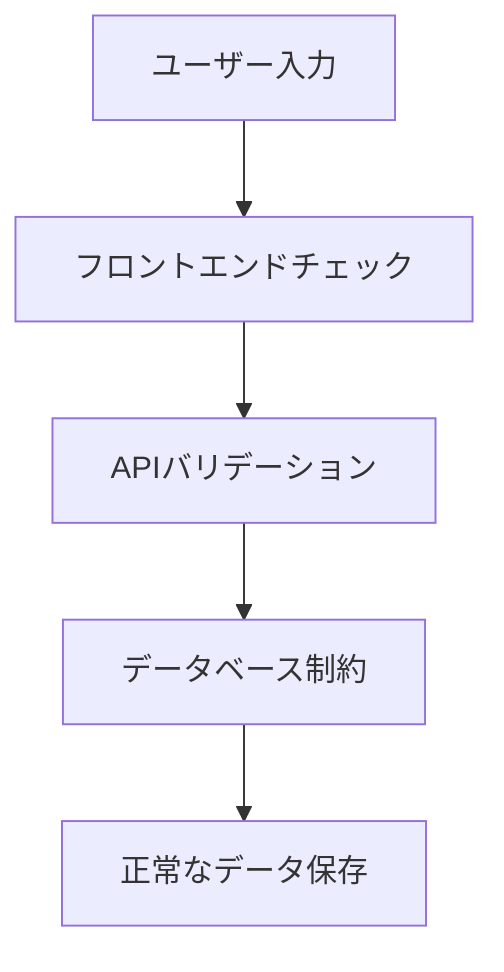
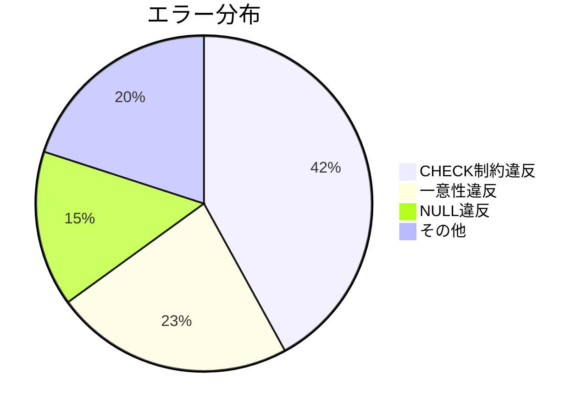

# データベース設計の制約と多層防御によるエラーハンドリングのベストプラクティス

## はじめに

現代のアプリケーション開発において、データの整合性を保ちつつ堅牢なシステムを構築するためには、データベース設計時の適切な制約設定と多層的なエラーハンドリングが不可欠です。本記事では、PostgreSQL を例にした具体的な実装パターンと、フロントエンドからデータベースまでの多層防御戦略を解説します。

## 目次

1. [多層防御の重要性](#多層防御の重要性)
2. [データベース制約の種類と活用方法](#データベース制約の種類と活用方法)
3. [エラーハンドリング設計パターン](#エラーハンドリング設計パターン)
4. [実践的な実装例](#実践的な実装例)
5. [監視とテスト戦略](#監視とテスト戦略)
6. [まとめ](#まとめ)

---

## 多層防御の重要性

### 3 層の防御レイヤー



### 各レイヤーの役割

| レイヤー       | 目的                             | 具体例                                 |
| -------------- | -------------------------------- | -------------------------------------- |
| フロントエンド | 即時フィードバックによる UX 向上 | 入力フォーマットのリアルタイムチェック |
| バックエンド   | ビジネスロジックの適用           | 権限チェック/複雑な条件検証            |
| データベース   | 最終的なデータ整合性の保証       | CHECK 制約/外部キー制約                |

---

## データベース制約の種類と活用方法

### 主要な制約タイプ

```sql
CREATE TABLE m_office (
    id SERIAL PRIMARY KEY,
    office_code VARCHAR(100) UNIQUE NOT NULL,
    office_status INT NOT NULL CHECK (office_status IN (0,1,2)),
    phone_number VARCHAR(20) CHECK (phone_number ~ '^\d+(-\d+)*$'),
    deleted_at TIMESTAMP NULL,
    FOREIGN KEY (status) REFERENCES status_codes(id)
);
```

### 制約選択の判断基準

| 制約タイプ    | 使用例                 | メリット                   | デメリット                |
| ------------- | ---------------------- | -------------------------- | ------------------------- |
| `CHECK`       | 限定された値の制御     | シンプルで高速             | 変更に ALTER TABLE が必要 |
| `FOREIGN KEY` | 他のテーブルとの整合性 | リレーションシップを明示化 | 結合コストが発生          |
| `UNIQUE`      | 重複禁止               | データの一意性を保証       | インデックスサイズ増加    |
| `NOT NULL`    | 必須項目の強制         | NULL 関連エラーを防止      | 柔軟性低下                |

---

## エラーハンドリング設計パターン

### PostgreSQL エラーコード対応表

| エラーコード | 発生要因          | 対応方針               |
| ------------ | ----------------- | ---------------------- |
| 23514        | CHECK 制約違反    | ユーザーに再入力を依頼 |
| 23505        | 一意性制約違反    | 重複データの存在を通知 |
| 23502        | NOT NULL 制約違反 | 必須項目の入力を依頼   |
| 22P02        | データ型不一致    | システムログを詳細記録 |

### Python でのエラーハンドリング例

```python
async def create_office(request: OfficeRequest):
    try:
        return await db.execute(insert_query)
    except asyncpg.CheckViolationError as e:
        logger.error(f"Check constraint failed: {e}")
        raise HTTPException(400, detail="無効な値が指定されました")
    except asyncpg.UniqueViolationError as e:
        logger.warning(f"Duplicate office code: {request.office_code}")
        raise HTTPException(409, detail="既に存在する事業所コードです")
```

---

## 実践的な実装例

### 住所情報の正規化設計

```sql
CREATE TABLE addresses (
    postal_code VARCHAR(7) CHECK (postal_code ~ '^\d{7}$'),
    prefecture VARCHAR(4) CHECK (prefecture IN (
        '北海道', '青森県', ..., '沖縄県')),
    city VARCHAR(20) NOT NULL,
    street VARCHAR(100) NOT NULL,
    building VARCHAR(50) NULL
);
```

### バリデーションロジックの共有化

```python
# shared_validators.py
PHONE_REGEX = r'^0\d{1,4}-\d{1,4}-\d{3,4}$'

def validate_phone(phone: str) -> bool:
    return re.fullmatch(PHONE_REGEX, phone) is not None
```

---

## 監視とテスト戦略

### 監視ダッシュボード例



### テストケース設計

| テスト種別 | 検証内容                       | 実施方法例                     |
| ---------- | ------------------------------ | ------------------------------ |
| 単体テスト | 個別バリデーションロジック     | pytest での関数単位テスト      |
| 統合テスト | エンドツーエンドのデータフロー | API テスト（Postman/requests） |
| 負荷テスト | 制約が性能に与える影響         | locust での同時接続テスト      |

---

## まとめ

- データベース制約はデータ品質を守る最後の砦
- 多層防御は UX 向上とシステム堅牢性の両立に必須
- エラーハンドリングにはエラーコード別の戦略が必要
- 共有バリデーションロジックで保守性を向上
- 継続的な監視とテストが長期運用の鍵

適切なデータベース設計と多層的なエラーハンドリングの実装により、変更に強く信頼性の高いシステムを構築できます。本記事で紹介したパターンを参考に、各プロジェクトに適したバリデーション戦略を構築してください。
